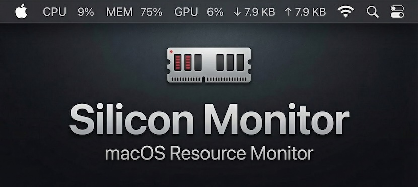

<p align="center">
  
</p>

<p align="center">
  <strong>A native macOS menu bar system monitor for Apple Silicon.</strong>
</p>

<p align="center">
  <a href="https://www.apple.com/macos/"></a>
  
  <a href="https://github.com/alexx855/silicon-monitor/releases/latest"></a>
  
</p>

<p align="center">
  <a href="#features">Features</a> •
  <a href="#why">Why</a> •
  <a href="#comparison">Comparison</a> •
  <a href="#installation">Installation</a>
</p>

---

## Features

* **Zero Impact** — Written in Rust. Minimal CPU (< 0.1%) & Memory (~15MB) usage.
* **Native Design** — Template icons adapt automatically to your wallpaper/theme.
* **Apple Silicon Ready** — First-class support for M-series GPU monitoring.
* **Fully Configurable** — Toggle CPU, GPU, Memory, or Network stats instantly.
* **Battery Efficient** — Smart polling that won't drain your MacBook.
* **Privacy Focused** — 100% local. No analytics. No network requests.

## Why?

I built this out of necessity. After switching from Ubuntu to macOS, I missed the simplicity of the **GNOME Resource Monitor** extension—just a clean line of text showing me exactly what my system was doing.

I tried everything else:

* **Electron apps** were too heavy (~150MB+ RAM for a text label? That's the "Electron Tax").
* **Paid apps** were overkill and expensive ($15+ with paid upgrades).
* **Free alternatives** often lacked proper **Apple Silicon GPU** support or didn't match the OS aesthetics.

**Silicon Monitor** is the answer. It uses **native macOS APIs** (specifically the private `IOReport` framework) to monitor your Apple Silicon GPU usage and power draw with zero overhead.

### How it works

* **Hybrid Architecture**: Uses `sysinfo` crate for standard metrics (CPU, Memory, Network).
* **Advanced GPU Monitoring**: Uses `IOReport` FFI to access private macOS APIs for accurate GPU residency (not just utilization).
* **True Insight**: Calculates `GPU Active Residency` via `IOReportCreateSubscription` and sample deltas, providing precise workload data.

It calculates **active residency** instead of just "utilization," giving you true insight into your GPU's workload. It runs without `sudo`, and looks exactly like a native system component in both light and dark modes.

## Comparison

| Feature | Silicon Monitor | Stats | iStat Menus | Electron Apps |
| :--- | :--- | :--- | :--- | :--- |
| **Price** | ✅ Free | ✅ Free | ❌ $14.99 | ❌ Varies |
| **Open Source** | ✅ MIT | ✅ MIT | ❌ Proprietary | ⚠️ Varies |
| **Idle Memory** | ✅ ~15 MB | ⚠️ ~45 MB | ⚠️ ~60 MB | ❌ 150-400 MB |
| **CPU (Idle)** | ✅ < 0.1% | ✅ < 0.5% | ✅ < 0.5% | ❌ 1.0 - 3.0% |
| **App Size** | ✅ < 7 MB | ⚠️ ~30 MB | ⚠️ ~40 MB | ❌ > 100 MB |
| **GPU Metrics** | ✅ Native (Residency) | ✅ IOReport | ✅ Proprietary | ❌ Utilization % |

## Installation

**Download** the latest binary from [Releases](../../releases).

**Build from Source**:

```bash
git clone https://github.com/alexx855/silicon-monitor.git
cd silicon-monitor
pnpm install
pnpm tauri build
```

---

<p align="center">
  Made with ❤️ by <a href="https://alexpedersen.dev/">Alex Pedersen</a>
</p>
